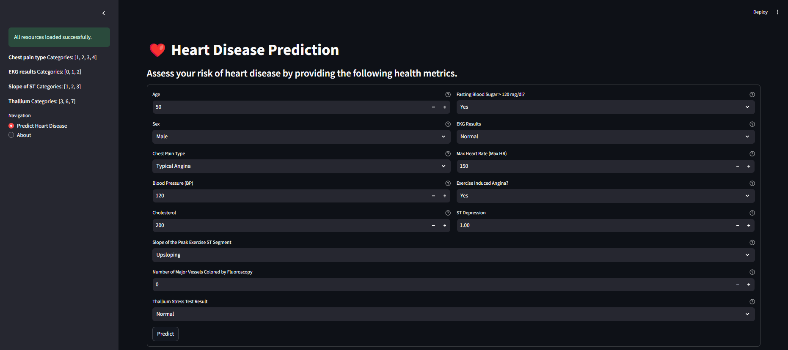
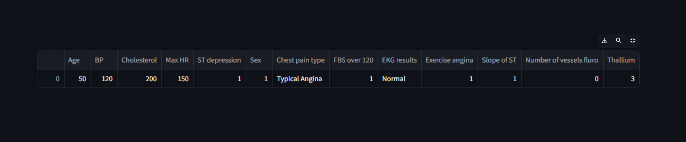
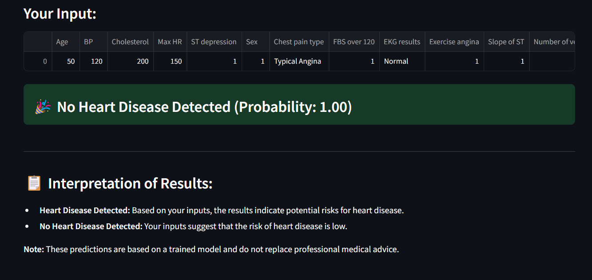

# ❤️ Heart Disease Prediction

This **Heart Disease Prediction** application uses machine learning to assess the risk of heart disease based on various health indicators. Built with **Streamlit** and powered by an **XGBoost** classifier, it provides users with a quick and interactive way to evaluate their heart disease risk by inputting essential health metrics.

## 📋 Table of Contents
- [Overview](#overview)
- [Features](#features)
- [Setup Instructions](#setup-instructions)
- [How to Use](#how-to-use)
- [Screenshots](#screenshots)
- [Future Enhancements](#future-enhancements)
- [Disclaimer](#disclaimer)

## Overview

Heart disease is a leading cause of health issues worldwide. This application uses various health metrics to predict the likelihood of heart disease, helping users gain insight into their cardiovascular health. By entering specific metrics, users can receive real-time predictions based on a pre-trained machine learning model.

## Features

- **User-Friendly Interface**: Intuitive form-based input for easy use.
- **Real-Time Predictions**: Get instant feedback on heart disease risk.
- **Detailed Results**: See the prediction and probability score, with visual cues.
- **Educational Insights**: Understand key health metrics associated with heart disease.

## Setup Instructions

To run the application locally, follow these steps:

1. **Clone the Repository**:
   ```bash
   git clone https://github.com/shady-mo20/Heart-Disease-Prediction.git
   cd Heart-Disease-Prediction
   ```

2. **Create a Virtual Environment (Optional but Recommended)**:
   ```bash
   python -m venv venv
   source venv/bin/activate  # On Windows: venv\Scripts\activate
   ```

3. **Install Dependencies**:
   ```bash
   pip install -r requirements.txt
   ```

4. **Run the Application**:
   ```bash
   streamlit run streamlit_app.py
   ```

5. **Access the Application**:
   - After running the command, open your browser and go to `http://localhost:8501` to interact with the application.

## How to Use

1. Open the app and navigate to the **Predict Heart Disease** tab.
2. Enter your health metrics, including:
   - **Age**
   - **Sex**
   - **Blood Pressure (BP)**
   - **Cholesterol Level**
   - **Max Heart Rate**
   - **Other relevant health factors** (e.g., chest pain type, fasting blood sugar, etc.)
3. Click **Predict** to see your heart disease risk and probability score.
4. Review the prediction and interpretation in the results section.

## Screenshots

### 1. Main Interface
Upon launching, the sidebar displays loaded resources and categorical feature details, while the main section provides a form to input health metrics.



### 2. User Input Preview
After entering data, a preview of your input is shown to confirm the details before making a prediction.



### 3. Prediction Results
The result displays the prediction (whether heart disease is detected) with a probability score. It also provides an interpretation of the results.



## Future Enhancements

- **Integration with Wearable Devices**: Allow users to input data directly from health trackers.
- **Personalized Health Tips**: Provide tailored recommendations based on the prediction results.
- **Historical Data Analysis**: Enable users to track changes in their health metrics over time.
- **Multi-language Support**: Make the application accessible to a broader audience by supporting additional languages.

## Disclaimer

⚠️ **This application is for educational purposes only and is not a substitute for professional medical advice.** Always consult a healthcare provider for any medical concerns. The predictions are based on a trained machine learning model and may not be 100% accurate.

